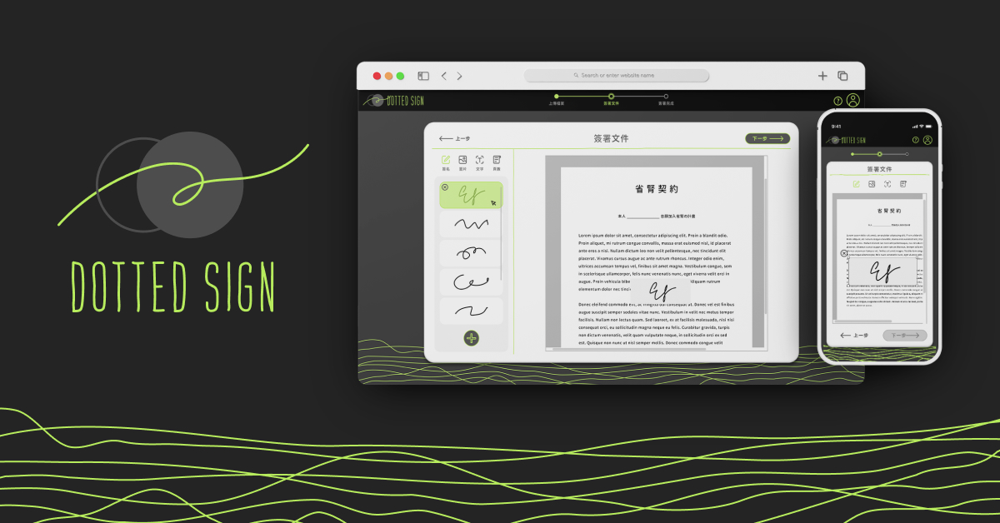

  

<h1 align="center">PDF Signature</h1>

  This is a web application for <code>signing PDF</code> documents online.

  
  

  

 

## Description

Users can upload PDF files, sign them online, and download the signed PDF files.  
The application also supports setting PDF passwords and storing PDF files in the local `IndexedDB`.  
Signatures, text, and images are stored in `localStorage` for reuse.

## Features

- Upload PDF files
- Sign PDF files electronically
- Download signed PDF files
- Adjustable signature position and size
- Set PDF passwords
- Open encrypted PDF files
- Support multiple languages
- Store PDF files in IndexedDB
- Custom signatures, text and images are stored in localStorage
- Edit signed PDF files

## Development

Clone this repository and install dependencies by running `pnpm`(Node.js version is v20.9.0), then:

- `pnpm dev`: Run in development mode
- `pnpm build`: Build in production mode
- `pnpm preview`: Run preview

## Use Technology

- Frontend: vue3, typescript, tailwindcss, pinia
- Environment construction: vite, eslint, prettier
- PDF Handling: jspdf
- Signature Drawing: [@component-hook/pdf-canvas](https://github.com/tzuyi0817/component-hook/tree/master/packages/pdf-canvas#readme)
- Compress image: browser-image-compression
- Internationalization: vue-i18n
- Local Storage: idb-keyval

## Usage

1. `Upload PDF File`: Click the upload button to select the PDF file you want to sign. The file will be stored in the local IndexedDB.
2. `Open Encrypted PDF`: If the PDF file is encrypted, you will be prompted to enter the password to open it.
3. `Add Signature`: Choose the position on the PDF where you want to add your signature. Signatures, text, and images will be stored in localStorage for reuse.
4. `Adjust Signature`: Drag and resize the signature as needed.
5. `Set PDF Password`: After completing the signature, you can set a password to open the PDF.
6. `Language Switch`: Select the language in the upper right corner of the header.
7. `Download Signed PDF`: After signing, click the download button to get the signed PDF file.
8. `Edit Signed PDF`: After signing, click the edit button to edit the signed PDF file.
9. `Batch Operation`: Batch archive, delete and reduction files

## Contribution

Contributions are welcome! If you have any suggestions or improvements, please submit a Pull Request or create an Issue.

## License

This project is licensed under the [MIT](https://opensource.org/licenses/MIT) License - see the [LICENSE](./LICENSE) file for details.
